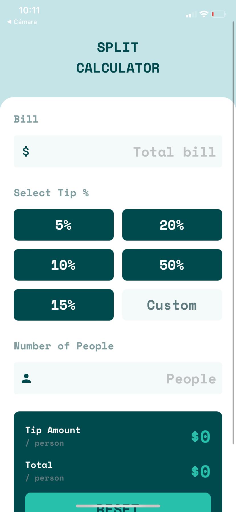
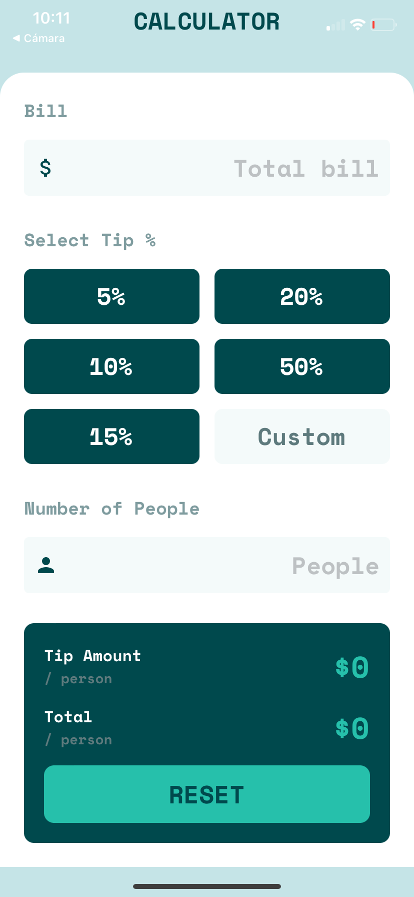
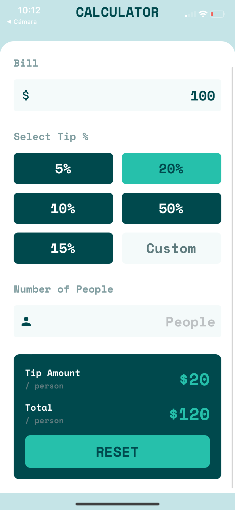

# Splitter App

Splitter is an application designed to quickly and easily calculate the total of a shared purchase among multiple people. Developed using React Native, this app offers an intuitive and user-friendly interface for splitting bills among friends, family, or dining companions. This project was a challenge from Frontend Mentor.

## Demo
<div style="display: flex">
  
  
  
</div>


## Features
### Calculate Total
* Enter the prices of purchased items.
* Automatically calculates the total purchase amount.

### Tip Calculation
* Optionally, calculate the tip based on a customizable percentage.

### Equitable Division
* Divide the total among the people at the table to determine each person's share.

### Additional Features
* Customize the tip percentage according to your preferences.

## Technologies Used
* React Native
* Expo
* Typescript

## Installation

1. Clone the repository
```
https://github.com/AGuardiola20/tipCalculator-react-native.git
```
2. Change to the project directory
```
cd tipCalculator-react-native
```

3. Install dependecies
```
npm install
```

4. Start the application
```
npx expo start
```
